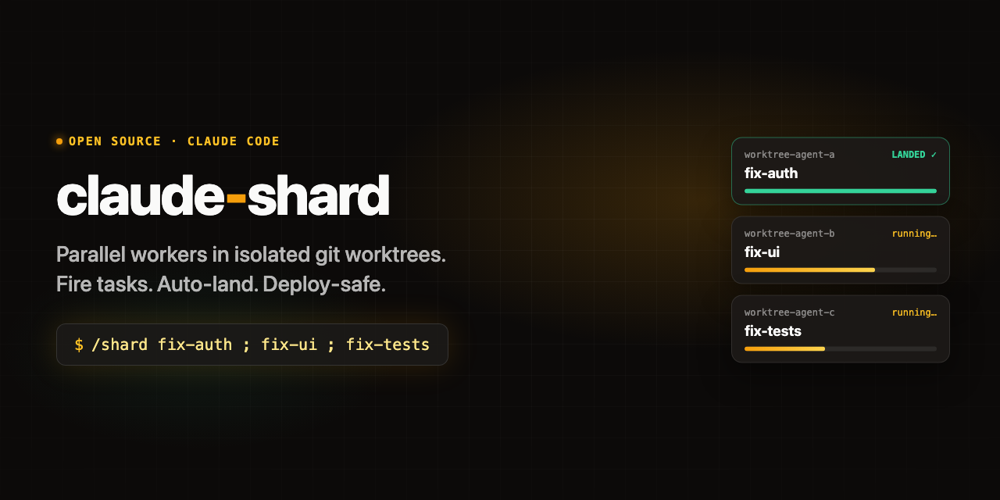
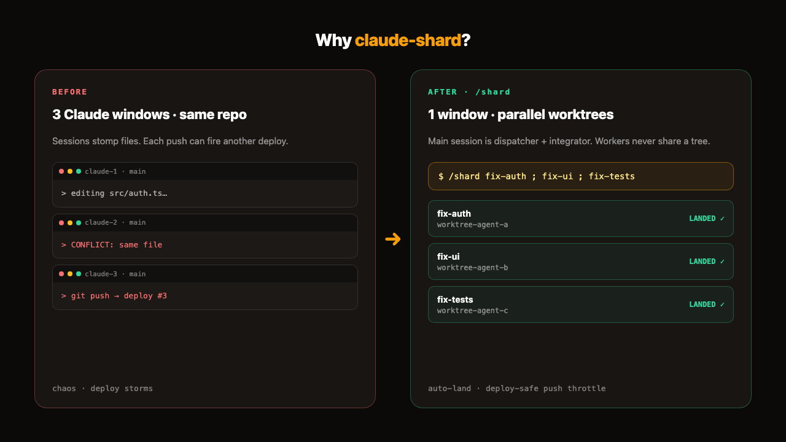
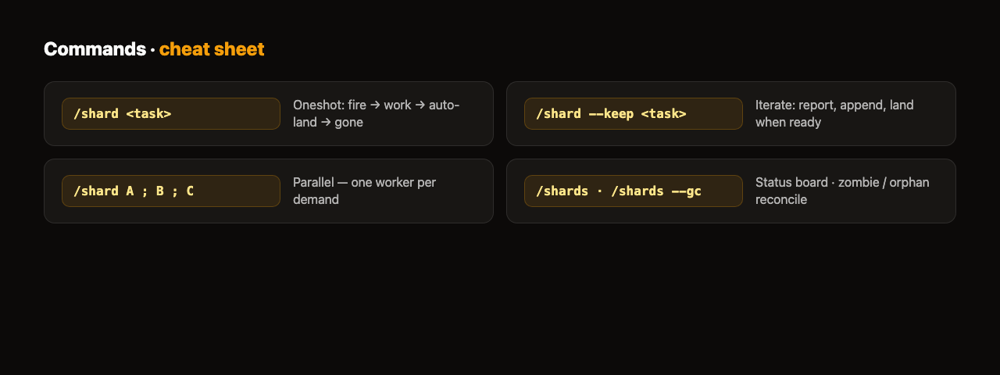
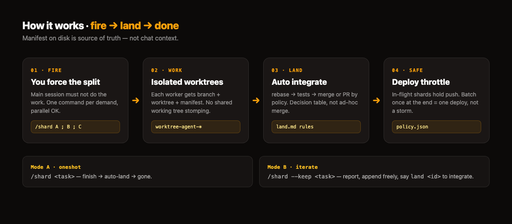

# claude-shard

<p align="center">
  
</p>

**Claude Code skill:** parallel workers in isolated git worktrees — fire, land, done.

> **Primary audience:** you run **Claude Code** as your main coding agent (one window is the driver).  
> This is **not** a Grok plugin, not an MCP, not a peer-review slash. It is a **Claude Code** skill + agent that sits on top of stock `Agent` + `isolation: worktree` + background.

繁體中文：[README.zh-TW.md](./README.zh-TW.md)

---

## When it is worth installing

Install if **most** of these are true:

1. **Claude Code is your main entry** — you live in one (or a few) Claude sessions, not multi-CLI peer slash.
2. You keep opening **2–3 Claude windows on the same repo** and they stomp the same files / confuse each other.
3. You want the main session to stay **dispatcher + integrator** — force the split with a command, not hope the model “uses subagents.”
4. Finishing work means **mergeable git units**, not paste-back text: rebase → tests → merge or PR.
5. The same repo is **deploy-connected** (Railway / Vercel / push-to-deploy) and **every push can mean a deploy** — you need **push throttle** so parallel shards don’t chain-deploy.

**Skip install** if you only need:

| Need | Use stock Claude Code instead |
| --- | --- |
| Short parallel explore / analysis | Multiple `Agent` calls in one message |
| Conversation fork (keep working both sides) | `/fork` (background session copy) |
| Large mechanical multi-file change → **one PR per unit** | Built-in **`/batch`** |
| Sync second opinion (Codex / Kimi) | Peer tools / MCP — not `/shard` |

Stock Claude already has worktrees, background agents, `/tasks`, and `/batch`.  
**Shard does not replace those.** It adds what is still missing for *your* workflow: **you force the split**, **disk manifest as SoT**, **auto land rules**, **same-repo land lock**, **deploy-safe push batching**.

<p align="center">
  
</p>

---

## What you get (Claude Code only)

| Command | What it does |
| --- | --- |
| `/shard <task>` | **Mode A (oneshot):** fire → worker finishes → completion notice **auto-lands** → gone |
| `/shard --keep <task>` | **Mode B (iterate):** report after each unit, no land; append freely; say `land <id>` to integrate |
| `/shard A ; B ; C` | Parallel tasks — one worker per demand |
| `/shards` | Status board: in-flight / stuck / open for follow-up (worktree/branch alive?, age, zombie flags) |
| `/shards --gc` | Three-way reconcile: zombie manifests / orphan worktrees / leftover `worktree-agent-*` branches (read-only report) |

<p align="center">
  
</p>

**Not peer review:** `/kimi` and `/codex` are **sync** second opinions. `/shard` is **async** background **implementation** with git land.

---

## Install (Claude Code)

```sh
git clone https://github.com/howardpen9/claude-shard.git
cd claude-shard
./install.sh   # symlink skills + agent → ~/.claude, create ~/.claude/shards/
```

Then **start a new Claude Code session** (skills load at session start).

- This directory is the source of truth; `~/.claude/skills/shard` etc. are symlinks.
- Runtime state lives under `~/.claude/shards/` (manifests, `policy.json`, locks) — not in git.

**Monorepo dogfood (ops workspace):** if you develop inside `coding-agent-mcps`, install from that tree instead:

```sh
cd /path/to/coding-agent-mcps/claude-shard && ./install.sh
```

---

## Why not only stock Claude Code?

Claude Code already has subagents (`Agent` + `background` + `isolation: worktree`), `/tasks`, `/fork`, and `/batch`. Shard does not reimplement the runtime — it adds **forced split by the user** and the **last mile of git landing**.

| | `/tasks` (built-in) | Raw subagent (built-in) | `/batch` (built-in) | `/shard` |
| --- | --- | --- | --- | --- |
| Who initiates the split | Model bookkeeping | You describe dispatch; model decides | Skill plans 5–30 units | **You force:** `/shard A ; B ; C` — main session must not do the work |
| Work unit | One-line description | One agent, text reply | worktree + **PR per unit** | worktree + branch + **manifest** = mergeable unit |
| After finish | Checkbox | Paste result; merge ad hoc | Open draft PRs | **Auto land:** rebase → tests → merge **or** PR per policy |
| State lifetime | In-session | Dies with the agent | Session / PR URLs | **Manifest on disk**; `/shards` anytime |
| Deploy awareness | None | None | None | Policy registry + **push throttle** (“push = one deploy”) |

Built-ins are **passive parts** — every dispatch needs prompt persuasion and every return needs improvised merge. Shard makes them **active verbs**: split is a command, land is a ruleset. One Claude Code window becomes dispatcher + integrator.

---

## How it works

<p align="center">
  
</p>

### 1. Manifest is source of truth

Each shard writes `~/.claude/shards/<agentId>.json` (repo, base, mode, status, timestamps, agentHistory). Land and iterate **read the file**, not chat context — context gets compressed and forgotten. Schema: `skills/shard/SKILL.md`.

### 2. Land decision table (statements, not questions)

“Is there a conflict?” and “should we merge?” never interrupt you by default. Automatic: rebase conflicts (resolve in worktree; large ones spawn a resolve-worker), red tests (one fix-worker pass), dirty tree (try fast-forward). Only three interrupt classes: first land-policy pick for a new repo, push/merge that would deploy (one batch ask), guard block / delete unmerged work. Full table: `skills/shard/land.md`.

### 3. Same-repo parallel safety (stop deploy chains)

- **Per-repo land lock** (`mkdir` atomic): two sessions never land the same repo at once
- **Rebase inside the worktree**: workers can resolve conflicts; also fixes harness worktrees pinned to a stale session snapshot (`rebase --onto`)
- **Push throttle**: if the same repo still has shards in flight → merge locally only, hold push; when all are done, batch-ask once = one deploy

### 4. Per-repo land policy registry

`~/.claude/shards/policy.json`: `local-merge | merge-no-push | pr`. First land on a new repo detects deploy signals (Railway / Vercel / workflows) → suggests a policy, asks once, stores it. `pr` never merges to main locally (avoids accidental deploys on deploy-connected repos).

---

## Layout

```
skills/shard/SKILL.md            # /shard fire flow + manifest schema
skills/shard/land.md             # land: decision table, lock, rebase, push throttle, iterate/discard
skills/shards/SKILL.md           # /shards board + interpretation rules
skills/shards/scripts/board.py   # reality-check + --gc reconcile (read-only)
agents/worker.md                 # background worker (isolation: worktree + background: true)
install.sh                       # symlink into ~/.claude
docs/assets/                     # README concept art
MONOREPO.md                      # coding-agent-mcps workspace note (if present)
```

---

## Harness gotchas (why land logic exists)

1. **Stale worktree base:** harness worktrees pin to the session start snapshot → naive `merge --ff-only` fails; use `git rebase --onto BASE $(git merge-base BASE WB) WB`.
2. **git-guard hook:** `branch -D` / `reset --hard` blocked; auto flows **never** smuggle `#guard-ok`. Workers stay on one branch → safe `branch -d` after merge.
3. **Stale `index.lock`:** rebase then immediate `switch`/`merge` races the lock; land steps run separately; on lock, `pgrep -fl git` then retry.

---

## Backlog

- Mode B cross-session revive (SendMessage fail → re-fire from `worktreeBranch`) not live-tested
- Full `pr` push+PR path not live-tested on a real repo
- resolve-worker / fix-worker paths not battle-tested
- Auto-detect post-land verify commands; large diffs auto-attach `/code-review` gate

---

## Reference value outside Claude Code

Even if your main agent is Grok Build / Codex / Cursor:

- **Manifest-as-SoT**, **land decision table**, and **push throttle** are reusable design for any worktree-parallel setup.
- Grok’s `/fork --worktree` / `spawn_subagent(isolation: worktree)` cover the *split* primitive; they do **not** ship this land/policy layer.
- In the **coding-agent-mcps** monorepo this folder is kept as an **ops example** of “dispatcher + integrator” — see monorepo `docs/PLAYBOOK.md` and `AGENTS.md`.

---

## Keywords

Claude Code, git worktree, parallel agents, background subagent, multi-agent workflow, auto land, deploy-safe merge, Railway push throttle, agent orchestration, dispatcher pattern
